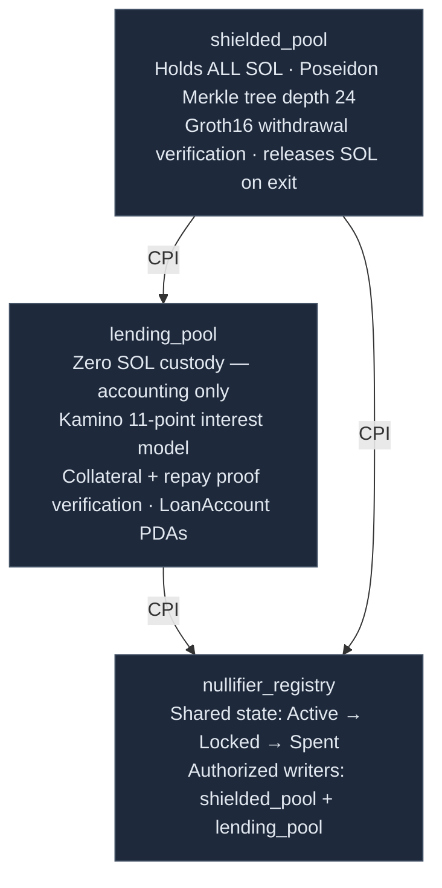
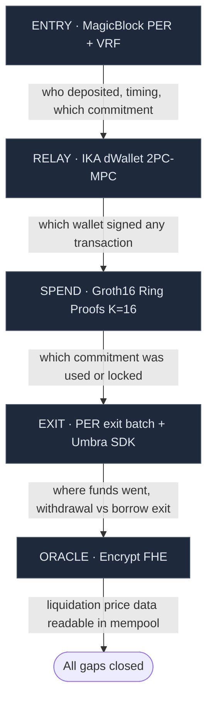
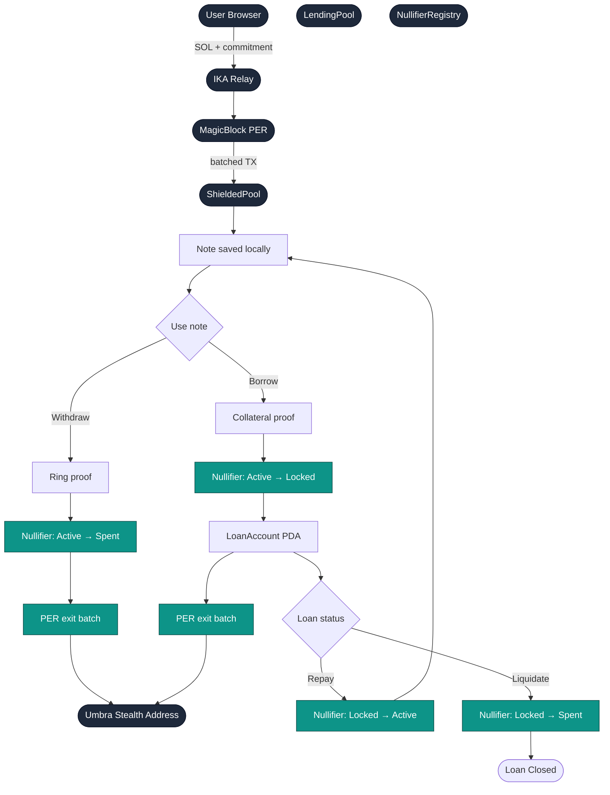
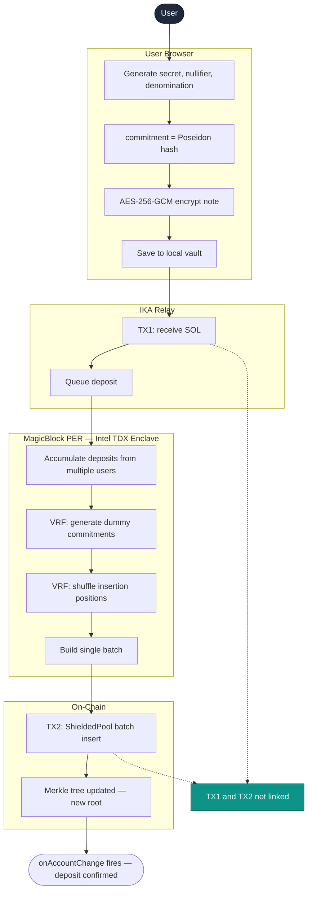
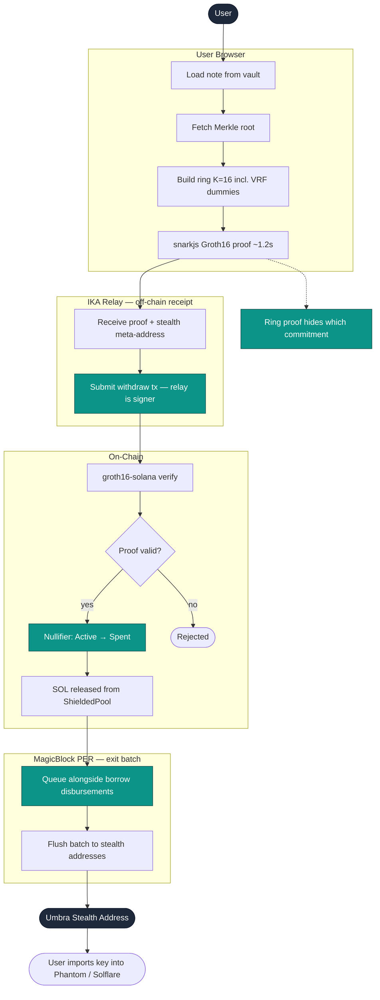
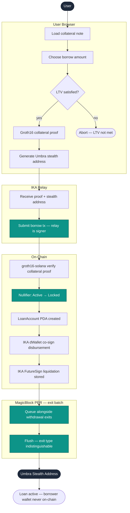
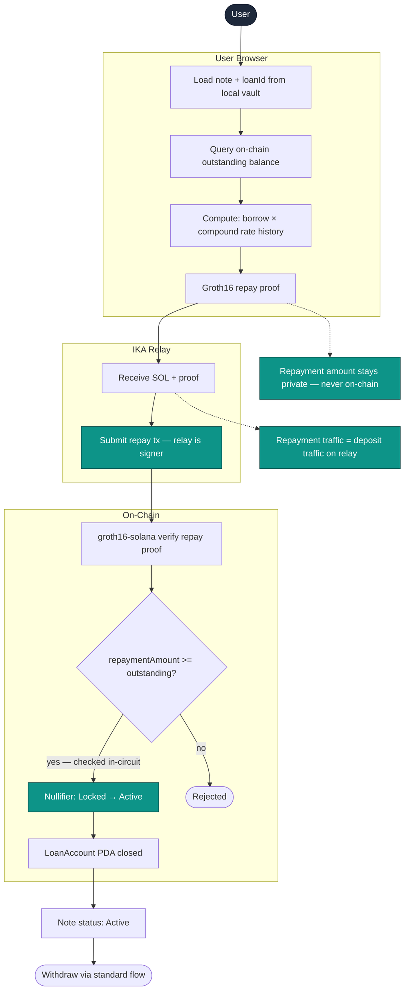

# ShieldLend — Privacy-First Lending Protocol on Solana

A zero-knowledge, privacy-preserving lending protocol on Solana. Deposits are unlinkable to wallets, withdrawal destinations are one-time addresses, oracle data is encrypted against MEV, and the signing infrastructure has no single operator key.

Built for the **Colosseum Frontier Hackathon 2026**.

---

## The Problem

On-chain lending has a fundamental privacy problem — and it is not just about hiding amounts.

Every interaction with a lending protocol creates a permanent, public record that an observer can use to build a profile of a user:

| Observable data | What it reveals |
|---|---|
| Deposit transaction | Depositor's wallet, amount, and timing |
| Loan disbursement | Borrower's wallet, loan size, and collateral |
| Repayment transaction | Confirmation that a wallet is a borrower |
| Withdrawal | Links the depositor's wallet to a withdrawal destination |

This matters for individuals who want financial privacy, for institutions that cannot reveal their treasury positions on-chain, and for anyone whose on-chain credit history should not be public record.

Existing privacy tools address one layer at a time: mixers hide amounts but not identities; stealth addresses hide destinations but not deposits; ZK proofs hide which commitment was spent but not who submitted the transaction. ShieldLend addresses all four layers across the full transaction lifecycle.

---

## Design Philosophy

Privacy in DeFi is not a feature — it is a stack.

ShieldLend applies four sequential protections across the transaction lifecycle. Each protection closes a specific gap that no other component addresses:

- **Entry protection** (MagicBlock PER + VRF): Deposits execute inside an Intel TDX enclave. Multiple users' deposits batch before any commitment reaches the Merkle tree — no observer can link a wallet to a specific commitment. VRF generates dummy commitments that are indistinguishable from real ones, permanently expanding the anonymity set for all future ring proofs.

- **Relay protection** (IKA dWallet): Every on-chain operation — deposit, withdrawal, borrow, repay — is submitted by the IKA relay wallet, not the user's wallet. The relay is a 2PC-MPC dWallet: no single key exists. Both the user and the IKA MPC network must participate to authorize any relay operation. All exits (withdrawals and borrow disbursements) route through the same relay → PER batch → stealth path, making their type indistinguishable on-chain.

- **State protection** (Encrypt FHE): Oracle price feeds for health factor computation are submitted as FHE ciphertexts. MEV bots cannot compute liquidation trigger conditions from encrypted mempool data. Aggregate solvency is tracked via homomorphic sum — total outstanding debt is verifiable without revealing individual positions.

- **Exit protection** (Umbra SDK): Every output — withdrawal destinations and loan disbursements — routes to a one-time Umbra stealth address. Each address is derived via ECDH from the recipient's published meta-address, has zero prior chain history, and is abandoned after use.

---

## Protocol Selection

Every protocol in ShieldLend's stack was chosen to close a specific privacy gap that no other tool addressed. The design started from privacy requirements and worked backwards to protocols — not the other way around.

The component-to-protocol mapping tables below show this gap → choice relationship for every function in the protocol. For the full decision rationale (alternatives considered, tradeoffs evaluated), see [`docs/DESIGN_DECISIONS.md`](docs/DESIGN_DECISIONS.md).

---

## Architecture

### Programs

ShieldLend is three Anchor programs. All SOL stays in one place. The other two programs only keep state.



For the full transaction lifecycle — how deposit connects to withdraw, borrow, repay, and liquidate — see [Flow Diagrams](#flow-diagrams) below.

---

### Privacy Stack

Each layer closes a specific privacy gap. The gap each layer closes cannot be addressed by any other layer in the stack.



---

## How Unlinkability Is Achieved

### Deposit

The user's wallet never appears in the ShieldedPool deposit transaction.

1. User generates a commitment client-side: `commitment = Poseidon(secret, nullifier, denomination)`. Secret and nullifier never leave the browser.
2. User sends SOL to the IKA relay address (TX1 — visible, but only shows funding of relay).
3. The IKA relay batches this deposit with others inside a **MagicBlock Private Ephemeral Rollup** (Intel TDX enclave). The batch processes privately.
4. PER commits a batch to ShieldedPool (TX2 — signer is the IKA relay wallet, not the user). TX1 and TX2 are not one-to-one.
5. VRF-randomized dummy commitments are inserted alongside real ones, permanently enlarging the anonymity set for all future ring proofs.

Observer sees TX1: "User funded relay." Observer sees TX2: "Relay deposited batch to pool." No linking between them.

### Withdrawal

No observer can connect the depositor's wallet to the withdrawal destination.

1. User loads their note (secret + nullifier) from the local encrypted vault.
2. `snarkjs` generates a **Groth16 ring proof**: proves ownership of one commitment in a ring of 16, without revealing which one. VRF dummies inserted at deposit time appear in the ring — the effective anonymity set exceeds K=16.
3. User sends proof to the **IKA relay** (off-chain). Relay submits the withdrawal transaction on-chain — relay wallet is the signer, not the user's wallet.
4. `groth16-solana` verifies the proof on-chain (< 200k compute units). SOL released from ShieldedPool to relay.
5. The exit is queued in **MagicBlock PER** alongside other withdrawals and borrow disbursements. PER flushes the batch to respective **Umbra stealth addresses**.
6. User derives the private key for their stealth address via Umbra SDK and imports it into Phantom or Solflare — the stealth address is a standard Solana wallet. SOL can be spent from it directly, just like any other wallet.

**Why no auto-forward to the main wallet:** forwarding from stealth address → main wallet would create an on-chain link between the two, permanently undoing the exit privacy. The Umbra stealth address IS the user's receiving wallet for this operation — it has a full Solana private key, derived once via ECDH. There is no friction beyond importing that key. Users can continue to use the stealth address for any on-chain activity or re-deposit into ShieldLend for continued privacy.

The ring proof hides *which* commitment was spent. Relay routing hides *who* submitted the proof. The stealth address hides *where* the funds went. No auto-forward preserves all three.

### Borrow

The collateral identity, borrower wallet, and disbursement destination are not linkable.

1. User selects a committed note as collateral.
2. `snarkjs` generates a **Groth16 collateral proof**: proves ring membership + denomination ≥ borrowed × LTV floor — in-circuit. Ring includes VRF dummies from deposit time.
3. User sends proof to the **IKA relay**. Relay submits on-chain — relay wallet is the signer.
4. `groth16-solana` verifies the proof on-chain.
5. The **IKA dWallet** receives an `approve_message()` CPI. The program validates LTV; the IKA MPC network co-signs the disbursement. Both gates required — no single operator can disburse.
6. SOL exits ShieldedPool → relay → **MagicBlock PER exit batch** (mixed with withdrawals) → **Umbra stealth address**. The exit is indistinguishable from a withdrawal on-chain.

No observer links "this commitment is locked as collateral" to "this wallet received a loan."

### Repay

Repayment does not reveal the borrower's identity or the repayment amount.

1. User generates a **repay_ring proof**: proves knowledge of the collateral nullifier. The repayment amount satisfies `repaymentAmount ≥ outstanding_balance` — verified in-circuit with repaymentAmount as a private input. The borrower's wallet is never revealed.
2. SOL goes via the **IKA relay** — indistinguishable from deposit relay traffic.
3. `groth16-solana` verifies the repay proof on-chain.
4. Loan PDA cleared, nullifier unlocked. Collateral note is ready for withdrawal.

---

## Flow Diagrams

The diagrams below trace each operation step-by-step. Teal nodes indicate where a privacy property is actively being enforced. Rendered by GitHub's native Mermaid support.

### Overall Transaction Journey



---

### Flow 1: Deposit



---

### Flow 2: Withdrawal



---

### Flow 3: Borrow



---

### Flow 4: Repay



---

## Privacy Status

Complete property-by-property breakdown of what is and is not hidden:

```
PROPERTY                                STATUS      MECHANISM
────────────────────────────────────────────────────────────────────────────────
Depositor wallet hidden                 ✓           IKA relay (relay is TX2 signer)
Deposit timing correlation broken       ✓           PER temporal batching (Intel TDX enclave)
Anonymity set ≥ 8 real (min batch)      ✓           min_real_deposits_before_flush = 8
VRF dummies indistinguishable           ✓           Poseidon(vrf_output, denomination) — same structure
                                                    as real commitments; VRF output not publicly derivable
Root tolerance (offline users)          ✓           30 historical roots retained; no lockout
Which commitment was spent              ✓           Ring proof hides ring_index (K=16 + VRF dummies)
Cross-contract nullifier unlinkability  ✓           nullifierHash includes SHIELDED_POOL_PROGRAM_ID
Re-insertion double-spend prevention    ✓           nullifierHash includes leaf_index
Withdrawal submitter wallet hidden      ✓           Withdrawal routed through relay
Withdrawal destination hidden           ✓           Umbra stealth (ECDH, fresh per op)
Borrow vs withdrawal exit               ✓           Unified relay → PER → stealth path
Which collateral note is locked         ✓           Collateral ring proof hides index
Borrower wallet hidden                  ✓           ZK private input + relay signer
Disbursement destination hidden         ✓           Umbra stealth address
Repayment amount hidden                 ✓           ZK private input, in-circuit check
Repayer wallet hidden                   ✓           ZK private input + relay routing
Oracle price (liquidation MEV)          ✓           Encrypt FHE encrypted oracle
FHE liquidation handle replay           ✓           Handle pinning — PDA seed binding [C-01]
Stale liquidation on healthy position   ✓           Consecutive breach confirmation (≥ 2 epochs)
Individual loan balances                ✓           Encrypt FHE encrypted storage
Who was liquidated                      ✓           Wallet never linked to loanId
Single operator key risk                ✓           IKA 2PC-MPC — user + MPC both required
Liquidation trust                       ✓           IKA FutureSign — pre-signed consent, condition-gated
Double-spend                            ✓           NullifierRegistry PDA + nullifierHash (position-bound)
────────────────────────────────────────────────────────────────────────────────
Borrow amount                           public      ZK public input — circuit requirement for on-chain LTV
That a borrow occurred                  public      LoanAccount PDA creation visible
Aggregate outstanding debt              disclosed   Threshold decryption result — total only, not individual
IP address visible to relay             not covered Tor/VPN required at application layer (user responsibility)
────────────────────────────────────────────────────────────────────────────────
```

---

## Funds and Accounting

SOL flows:
- **Deposit**: IKA relay → ShieldedPool (via PER batch)
- **Withdraw**: ShieldedPool → IKA relay → PER exit batch → Umbra stealth address
- **Borrow**: ShieldedPool → IKA relay → PER exit batch → Umbra stealth address (same path as withdraw)
- **Repay**: IKA relay → ShieldedPool; LendingPool clears loan PDA

---

## ZK Circuits

All circuits produce Groth16 proofs verified on-chain by `groth16-solana`.

| Circuit | Proves | Public inputs/outputs |
|---|---|---|
| `withdraw_ring.circom` | Ring membership (K=16) + Merkle inclusion at `leaf_index` (depth 24) | `ring[16]`, `nullifierHash`, `root`, `denomination_out` |
| `collateral_ring.circom` | Ring membership + `denomination × minRatioBps ≥ borrowed × 10000` | `ring[16]`, `nullifierHash`, `root`, `borrowed`, `minRatioBps` |
| `repay_ring.circom` | Nullifier knowledge + `repaymentAmount ≥ outstanding_balance` (in-circuit, amount private) | `nullifierHash`, `loanId`, `outstanding_balance` |

**Nullifier formula** (all circuits): `nullifierHash = Poseidon(nullifier, leaf_index, SHIELDED_POOL_PROGRAM_ID)`

- `leaf_index`: private input proving position in the Merkle tree — prevents re-insertion attacks
- `SHIELDED_POOL_PROGRAM_ID`: domain separator — prevents cross-contract nullifier correlation

**Root validation**: proofs are valid against any of the 30 most recent Merkle roots (not just the current root) — users can be offline for up to ~2.5 hours without losing access to their notes.

---

## Fixed Denominations

Deposits use fixed denominations (0.1 SOL, 1 SOL, 10 SOL). This is a requirement of the ZK circuit design: denomination is embedded in the commitment hash and is a public output of the withdrawal proof. Standardized denominations prevent amount-based correlation — every participant in a denomination pool looks identical on-chain.

Loan amounts are variable. The borrow amount appears as a public input to the collateral ring circuit — required for on-chain LTV verification binding.

---

## Protocol Solvency — Aggregate Without Individual Exposure

ShieldLend maintains continuous solvency guarantees without revealing oracle price data or individual collateral positions.

**Aggregate monitoring (always-on):** Oracle price feeds are submitted as Encrypt FHE ciphertexts. Collateral values are computed homomorphically — price × denomination for each active loan — and summed without decrypting any individual position:
```
total_collateral_value = Σ(FHE_price × denomination[i])   // FHE multiplication + addition
total_outstanding      = Σ(borrow_amount[i])               // plaintext sum — borrow amounts are public
```
Threshold decryption reveals ONLY `total_collateral_value`. Individual collateral positions and the oracle price used for computation stay hidden. MEV bots monitoring the mempool cannot compute breach conditions from encrypted price inputs.

**Targeted audit (on-demand):** For compliance disclosure of a specific loan, threshold decryption reveals that loan's outstanding balance to the auditor. Borrower identity is not revealed — only the amount.

---

## Component → Protocol Mapping

### ShieldedPool

| Function | Protocol | Why this protocol |
|---|---|---|
| Deposit batching + execution | MagicBlock PER (TDX enclave) | Intel TDX required to batch deposits without any party observing the deposit→commitment mapping |
| Exit batching (withdrawals + disbursements) | MagicBlock PER (same enclave) | Both withdrawal and borrow disbursement exits batch together — type indistinguishable on-chain |
| Anonymity set expansion | MagicBlock VRF | Dummy insertions must be cryptographically unbiasable; VRF provides per-shuffle on-chain verifiable randomness; carries forward into all future ring proofs |
| Withdrawal submission | IKA relay | User wallet would be the ring proof transaction signer if submitted directly — permanently linking wallet to 16 ring candidates; relay routing prevents this |
| Withdrawal authorization | groth16-solana | Ring proof verified on-chain atomically with fund release; BN254 native syscalls (<200k CU) |
| Withdrawal recipient | Umbra SDK | One-time stealth address with zero prior history; Umbra SDK handles generation, key derivation |

### LendingPool

| Function | Protocol | Why this protocol |
|---|---|---|
| Interest rate model | Kamino klend fork | Poly-linear 11-point model from a $3.2B TVL production protocol; audited; Anchor-native |
| Collateral proof verification | groth16-solana | LTV check is a circuit constraint — must verify on-chain before disbursement |
| Repayment proof verification | groth16-solana | Repay proof hides repayment amount (private input) and borrower wallet; on-chain verification required to clear loan PDA |
| Disbursement routing | IKA relay + PER | Disbursement exits same relay → PER → stealth path as withdrawals; indistinguishable on-chain |
| Disbursement signing | IKA dWallet | Co-signing requires program LTV validation AND IKA MPC network; no single operator key |
| Disbursement recipient | Umbra SDK | Same reason as withdrawals — fresh stealth address, borrower wallet never on-chain |
| Oracle MEV prevention | Encrypt FHE | Price feeds as FHE ciphertexts; health_factor computed homomorphically; MEV bots cannot read pending price updates |
| Aggregate solvency | Encrypt FHE | Homomorphic sum of loan balances; only total revealed, individual positions stay encrypted |
| Compliance disclosure | Encrypt threshold decryption | Individual loan balance disclosed to auditor via 2/3 MPC threshold decrypt; no global exposure |
| Liquidation pre-authorization | IKA FutureSign | Borrower consents at borrow time; neither borrower (cannot block) nor operator (cannot trigger without condition) has unilateral control |

---

## Tech Stack

**On-Chain**
- Anchor (Rust smart contracts)
- Kamino klend fork (lending logic)
- groth16-solana (ZK proof verification, BN254 native syscalls, Light Protocol Labs)
- MagicBlock PER macros (`#[ephemeral]`, `#[delegate]`, `#[commit]`)
- MagicBlock VRF SDK
- IKA dWallet Anchor CPI (`ika-dwallet-anchor`)
- Encrypt FHE Anchor integration (`encrypt-anchor`)
- Poseidon hash (matching circuits)

**Off-Chain / Client**
- snarkjs 0.7.4 (Groth16 browser proof generation, ~1.2s)
- Circom (withdraw_ring, collateral_ring, repay_ring)
- Umbra SDK (TypeScript, stealthaddress.dev)
- AES-256-GCM + HKDF (client-side note vault, from wallet signature)
- Next.js 14 + React 18
- @solana/wallet-adapter + @solana/web3.js (`onAccountChange` for post-flush automation)

---

## Repository Structure

```
shieldlend-solana/
├── programs/
│   ├── shielded_pool/          # deposit, withdraw, Merkle tree, VRF integration
│   ├── lending_pool/           # Kamino klend fork + IKA + Encrypt FHE wiring
│   └── nullifier_registry/     # PDA nullifier set
├── circuits/
│   ├── withdraw_ring.circom    # K=16 ring + depth-24 Merkle
│   ├── collateral_ring.circom  # K=16 ring + LTV in-circuit
│   ├── repay_ring.circom       # nullifier knowledge + repaymentAmount >= outstanding_balance
│   └── keys/                   # .zkey + .vkey.json for all three circuits
├── tests/
│   ├── shielded_pool.ts
│   ├── lending_pool.ts
│   └── live-test.mjs           # E2E devnet
├── frontend/
│   ├── app/
│   │   └── api/
│   │       ├── ika/route.ts    # IKA dWallet approve_message endpoint
│   │       └── per/route.ts    # MagicBlock PER deposit + exit endpoint
│   ├── lib/
│   │   ├── circuits.ts         # snarkjs proof generation
│   │   ├── umbra.ts            # Umbra SDK integration (ALL stealth addresses)
│   │   ├── encrypt.ts          # Encrypt FHE ciphertext interaction
│   │   └── noteStorage.ts      # AES-256-GCM localStorage vault
│   └── components/
│       ├── DepositForm.tsx
│       ├── WithdrawForm.tsx
│       ├── BorrowForm.tsx
│       └── RepayForm.tsx
├── docs/
│   ├── architecture.md         # Deep technical architecture and program design
│   ├── PRIVACY_MODEL.md        # Threat model and unlinkability analysis
│   ├── DESIGN_DECISIONS.md     # Protocol selection rationale for every component
│   └── HACKATHON.md            # Track eligibility and submission narratives
├── Anchor.toml
├── Cargo.toml
├── package.json
└── README.md
```

---

## Hackathon Tracks

| Track | Sponsor | ShieldLend implements |
|---|---|---|
| IKA + Encrypt Frontier | Superteam | dWallet relay (all flows) + FutureSign + encrypted oracle + aggregate solvency |
| Colosseum Privacy Track | MagicBlock | PER deposit batching + PER exit batching + VRF dummy insertion |
| Umbra Side Track | Frontier | Umbra SDK for all output addresses (withdrawals + loan disbursements) |

Each track covers a distinct privacy layer — entry execution, transaction routing, on-chain state, and exit address — with no overlap between them.

---

## Pre-Alpha Status

Several protocols used in ShieldLend are in pre-alpha on devnet. Hackathon integration uses mock signers / unencrypted fallbacks. Production deployments require mainnet availability.

| Protocol | Devnet status | Production path |
|---|---|---|
| IKA dWallet | Pre-alpha (mock signer) | IKA Solana mainnet |
| Encrypt FHE | Pre-alpha (plaintext fallback) | Encrypt mainnet |
| MagicBlock PER | Devnet (Discord access required) | MagicBlock PER mainnet |
| groth16-solana | Mainnet-beta ready | BN254 syscalls live since Solana 1.18.x |
| Umbra SDK | Mainnet alpha (Solana, Feb 2026) | Production-ready |

---

## Architecture Inspirations

ShieldLend builds on and extends proven patterns from production privacy protocols. Each borrowed pattern is adapted to Solana's account model and explicitly cited in our architecture documentation. We are building on existing work, not reinventing it — and going further where no existing protocol has gone.

| Pattern | Inspired by | What we adapted | Where it appears |
|---|---|---|---|
| Historical root ring buffer | Railgun, Tornado Cash | Retain 30 historical roots; `historical_roots.contains(proof.root)` | `ShieldedPoolState` |
| Position-dependent nullifiers | Penumbra | `Poseidon(nullifier, leaf_index, PROGRAM_ID)` prevents re-insertion attacks | All three circuits |
| App-siloed nullifier domain | Aztec | `SHIELDED_POOL_PROGRAM_ID` in nullifierHash prevents cross-contract correlation | All three circuits |
| Three-step async liquidation | Laolex/shieldlend (FHE) | Handle pinning + breach confirmation adapted from Solidity mapping to Anchor PDA | `lending_pool::liquidate` |
| Handle pinning [C-01] | Laolex/shieldlend (FHE) | PDA seed binding replaces storage-slot binding | `LoanAccount` fields |
| Keeper-based interest accrual | Laolex/shieldlend (FHE) | Slot-based timing, off-chain utilization estimation | `lending_pool::accrue_interest` |
| Threshold decryption for aggregate solvency | Penumbra (flow encryption) | Homomorphic sum of FHE balances, threshold decrypt reveals total only | Encrypt FHE integration |
| Atomic borrow + exit | Nocturne (Operation model) | Verify ring proof and queue exit in same instruction | `lending_pool::borrow` |
| VRF dummy indistinguishability | Original design (no prior art) | `Poseidon(vrf_output, denomination)` — same structure as real commitments | `shielded_pool::flush_epoch` |
| Unified exit path | Original design | Withdrawal + borrow disbursement through same PER exit batch | `shielded_pool::flush_exits` |

The full competitive analysis that produced this table is in [`docs/RESEARCH_REPORT.md`](docs/RESEARCH_REPORT.md).

---

## Documentation

| Document | Contents |
|---|---|
| [`docs/architecture.md`](docs/architecture.md) | Program design, CPI flows, account model, data structures |
| [`docs/PRIVACY_MODEL.md`](docs/PRIVACY_MODEL.md) | Unlinkability analysis per flow, residual risks, accepted disclosures |
| [`docs/THREAT_MODEL.md`](docs/THREAT_MODEL.md) | Adversary classes, attack scenarios, full privacy property table, trust assumptions |
| [`docs/DESIGN_DECISIONS.md`](docs/DESIGN_DECISIONS.md) | ADR-style rationale for every protocol and architecture choice |
| [`docs/NOTE_LIFECYCLE.md`](docs/NOTE_LIFECYCLE.md) | Note state machine, LoanAccount lifecycle, protocol parameters, operational modes |
| [`docs/HACKATHON.md`](docs/HACKATHON.md) | Track-by-track eligibility, submission narratives, required integrations |
| [`docs/RESEARCH_REPORT.md`](docs/RESEARCH_REPORT.md) | Full competitive analysis: competitor profiles, production protocol research, vulnerability findings |

---

## Getting Started

```bash
# Solana CLI + Anchor prerequisites
solana-install init 1.18.x
anchor --version  # 0.30.x

# Install frontend dependencies
cd frontend && npm install

# Join MagicBlock Discord for PER devnet endpoint access
# https://discord.com/invite/MBkdC3gxcv

# Configure environment
cp frontend/.env.example frontend/.env.local
# Set: IKA_DWALLET_*, MAGICBLOCK_PER_ENDPOINT, UMBRA_*, SOLANA_RPC_URL
```
